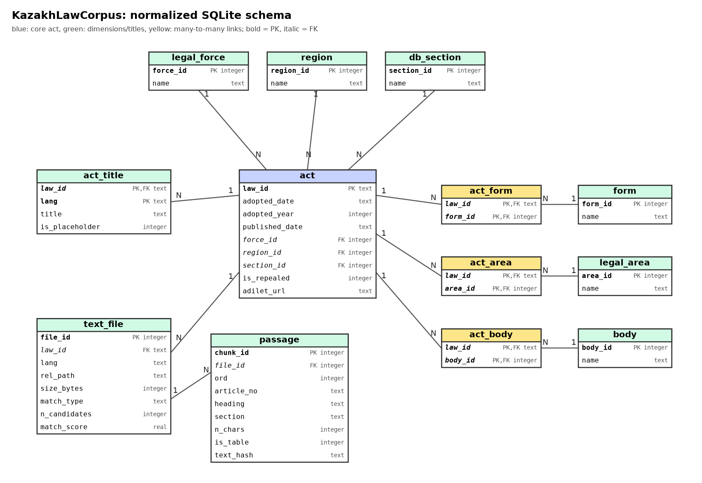
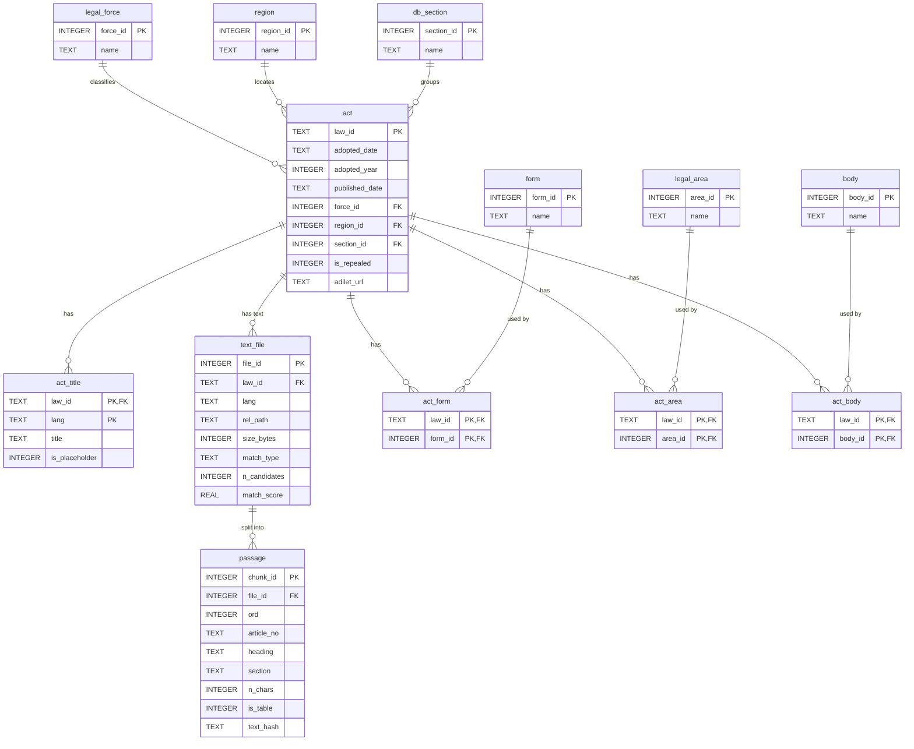

# ER diagram

```mermaid
erDiagram
    legal_force ||--o{ act : "classifies"
    region ||--o{ act : "locates"
    db_section ||--o{ act : "groups"
    act ||--o{ act_title : "has"
    act ||--o{ text_file : "has text"
    text_file ||--o{ passage : "split into"
    act ||--o{ act_form : "has"
    form ||--o{ act_form : "used by"
    act ||--o{ act_area : "has"
    legal_area ||--o{ act_area : "used by"
    act ||--o{ act_body : "has"
    body ||--o{ act_body : "used by"
    act {
        TEXT law_id PK
        TEXT adopted_date
        INTEGER adopted_year
        TEXT published_date
        INTEGER force_id FK
        INTEGER region_id FK
        INTEGER section_id FK
        INTEGER is_repealed
        TEXT adilet_url
    }
    act_title {
        TEXT law_id PK,FK
        TEXT lang PK
        TEXT title
        INTEGER is_placeholder
    }
    text_file {
        INTEGER file_id PK
        TEXT law_id FK
        TEXT lang
        TEXT rel_path
        INTEGER size_bytes
        TEXT match_type
        INTEGER n_candidates
        REAL match_score
    }
    passage {
        INTEGER chunk_id PK
        INTEGER file_id FK
        INTEGER ord
        TEXT article_no
        TEXT heading
        TEXT section
        INTEGER n_chars
        INTEGER is_table
        TEXT text_hash
    }
    legal_force {
        INTEGER force_id PK
        TEXT name
    }
    region {
        INTEGER region_id PK
        TEXT name
    }
    db_section {
        INTEGER section_id PK
        TEXT name
    }
    act_form {
        TEXT law_id PK,FK
        INTEGER form_id PK,FK
    }
    act_area {
        TEXT law_id PK,FK
        INTEGER area_id PK,FK
    }
    act_body {
        TEXT law_id PK,FK
        INTEGER body_id PK,FK
    }
    form {
        INTEGER form_id PK
        TEXT name
    }
    legal_area {
        INTEGER area_id PK
        TEXT name
    }
    body {
        INTEGER body_id PK
        TEXT name
    }
```
